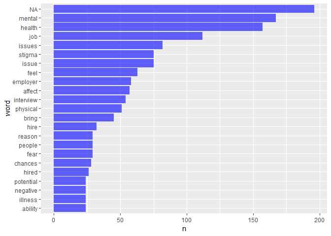
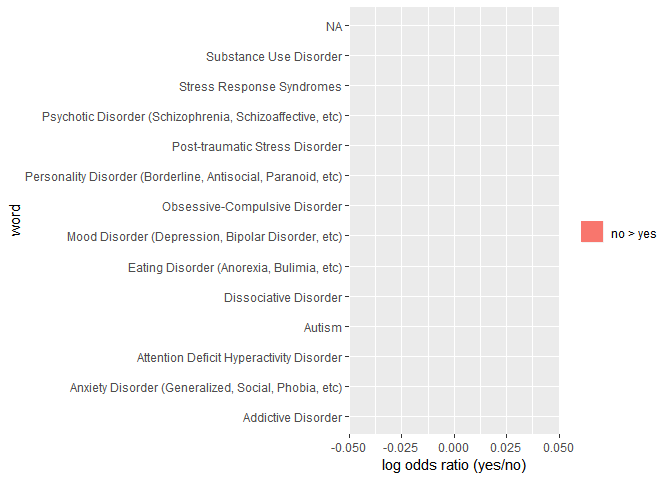
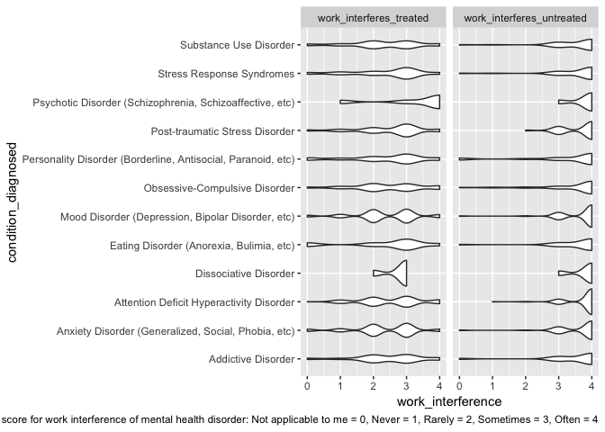

sc4456
================

``` r
mentalhealth_2016_df = read_csv("./data/mental_health_in_tech_2016.csv") 
```

    ## Warning: Duplicated column names deduplicated: 'Why or why not?' => 'Why or
    ## why not?_1' [40]

    ## Parsed with column specification:
    ## cols(
    ##   .default = col_character(),
    ##   `Are you self-employed?` = col_double(),
    ##   `Is your employer primarily a tech company/organization?` = col_double(),
    ##   `Is your primary role within your company related to tech/IT?` = col_double(),
    ##   `Do you have medical coverage (private insurance or state-provided) which includes treatment of  mental health issues?` = col_double(),
    ##   `Do you have previous employers?` = col_double(),
    ##   `Have you ever sought treatment for a mental health issue from a mental health professional?` = col_double(),
    ##   `What is your age?` = col_double()
    ## )

    ## See spec(...) for full column specifications.

``` r
colnames(mentalhealth_2016_df) <- c("self_employed", "num_employees", "tech_company", "tech_role", "benefits", "care_options", "employer_discussion", "employer_help", "anonymity", "medical_leave", "mental_health_consequences", "physical_health_consequences", "coworkers_discussion", "supervisor_discussion", "mental_vs_physical", "obs_consequence", "medical_coverage", "help_resourcces", "whether_reveal_business_contacts", "reveal_concequences_business_contects", "whether_reveal_coworkers", "reveal_concequences_coworkers", "productivity_affect", "work_time_affected", "preemployers", "preemployers_benefits", "preemployers_care_options", "preemployers_discussion", "preemployer_help", "pre_anonymity", "pre_mental_health_consequences", "pre_physical_health_consequences", "pre_coworkers_discussion", "pre_supervisors_discussion", "pre_mental_vs_physical", "pre_obs_consequence", "physical_health_interview", "physical_health_interview_reason", "mental_health_interview", "mental_health_interview_reason", "career_influence", "coworkers_view", "friends_family_share", "unsupportive_badly_handled", "less_likely_reveal", "family_history", "mental_health_previous", "mental_health_now", "condition_diagnosed", "possible_condition", "professional_diagnosed", "condition_professional_diagnosed", "seek_treatment", "work_interferes_treated", "work_interferes_untreated", "age", "gender", "country_live", "territory_live", "country_work", "territory_work", "work_position_kind", "work_remotely")
attach(mentalhealth_2016_df)
```

#### table for medical leave difficulty

``` r
#### table for medical leave difficulty
summary(as.factor(medical_leave)) %>% knitr::kable() 
```

|                            |    x|
|----------------------------|----:|
| I don't know               |  150|
| Neither easy nor difficult |  178|
| Somewhat difficult         |  199|
| Somewhat easy              |  281|
| Very difficult             |  118|
| Very easy                  |  220|
| NA's                       |  287|

### mental\_health\_interview\_reason for employee in tech company

``` r
### mental_health_interview_reason

MH_interview_reason_inspec = mentalhealth_2016_df %>% filter(tech_company == 1) 
MH_interview_reason_inspec= MH_interview_reason_inspec %>% unnest_tokens(word, mental_health_interview_reason)

data(stop_words)
MH_interview_reason_inspec  = 
  anti_join(MH_interview_reason_inspec, stop_words) 
```

    ## Joining, by = "word"

``` r
MH_interview_reason_inspec  %>% count(word, sort = TRUE) %>% 
  top_n(20) %>% 
  mutate(word = fct_reorder(word, n)) %>% 
  ggplot(aes(x = word, y = n)) +
  geom_bar(stat = "identity", fill = "blue", alpha = 0.6) +
  coord_flip()
```

    ## Selecting by n



### Condition\_diagonised tidy

``` r
# add_id
mentalhealth_2016_df$ID = seq.int(nrow(mentalhealth_2016_df))

# split Mental health disorders(for example, one person has several kinds of MH disorders)
df = mentalhealth_2016_df %>% select(ID, condition_diagnosed, seek_treatment) %>% mutate(condition_diagnosed = str_split(condition_diagnosed, "\\|")) %>% unnest(condition_diagnosed) 
```

``` r
ratios = df %>% 
  group_by(condition_diagnosed, seek_treatment) %>% 
  summarize(count = n()) %>%
  filter(count >= 3) %>% 
  mutate(seek_treatment = ifelse(seek_treatment == 1, "yes", "no")) %>% 
  spread(seek_treatment, count, fill = 0) %>% janitor::clean_names() 

ratios = 
  ratios %>% 
    mutate(
    seek_treatment_odds = (yes + 1) / (sum(ratios$yes) + 1),
    not_seek_treatment_odds = (no + 1) / (sum(ratios$no) + 1), 
    log_OR = log(seek_treatment_odds / not_seek_treatment_odds)) %>% 
  arrange(desc(log_OR))
```

``` r
ratios %>%
  mutate(pos_log_OR = ifelse(log_OR > 0, "yes > no", "no > yes")) %>% 
  group_by(pos_log_OR) %>%
  top_n(15, abs(log_OR)) %>%
  ungroup() %>%
  mutate(word = fct_reorder(condition_diagnosed, log_OR)) %>%
  ggplot(aes(word, log_OR, fill = pos_log_OR)) +
  geom_col() +
  coord_flip() +
  ylab("log odds ratio (yes/no)") +
  scale_fill_discrete(name = "")
```



work\_interferes "Not applicable to me" = 0, "Never" = 1, "Rarely" = 2, "Sometimes" = 3, "Often" = 4

``` r
work_if = mentalhealth_2016_df %>% 
  select(ID, condition_diagnosed, work_interferes_treated, work_interferes_untreated) %>% 
  mutate(condition_diagnosed = str_split(condition_diagnosed, "\\|")) %>% unnest(condition_diagnosed) %>%    filter(!is.na(condition_diagnosed)) %>% 
  mutate(work_interferes_treated = recode(work_interferes_treated ,"Not applicable to me" = 0, "Never" = 1, "Rarely" = 2, "Sometimes" = 3, "Often" = 4),
         work_interferes_untreated = recode(work_interferes_treated ,"Not applicable to me" = 0, "Never" = 1, "Rarely" = 2, "Sometimes" = 3, "Often" = 4)) %>% gather(key = "treat_or_not", value ="work_interference",work_interferes_treated:work_interferes_untreated)
```

    ## Warning in recode.numeric(work_interferes_treated, `Not applicable to me` =
    ## 0, : NAs introduced by coercion

``` r
# work_interferes_untreated = as.numeric(work_interferes_untreated)) %>% 
#  mutate(work_interferes_untreated = work_interferes_untreated*-1) %>% 
#  gather(key = "treat_or_not", value ="work_interference",work_interferes_treated:work_interferes_untreated)


common_disease = work_if %>%
  group_by(condition_diagnosed) %>% 
  summarise(count = n()) %>% 
  mutate(condition_diagnosed = fct_reorder(condition_diagnosed, count)) %>% 
  top_n(12, count) 

### common disease: ggplot(aes(y =condition_diagnosed, x = count)) + geom_path()

common_disease_list = common_disease$condition_diagnosed


plot_1 = work_if %>% 
  filter(condition_diagnosed %in% common_disease_list) %>% 
  ggplot(aes(x = condition_diagnosed, y = work_interference)) + geom_violin() + facet_wrap(~treat_or_not) +
  coord_flip() + labs(caption = "Set score for work interference of mental health disorder: Not applicable to me = 0, Never = 1, Rarely = 2, Sometimes = 3, Often = 4")
plot_1
```


